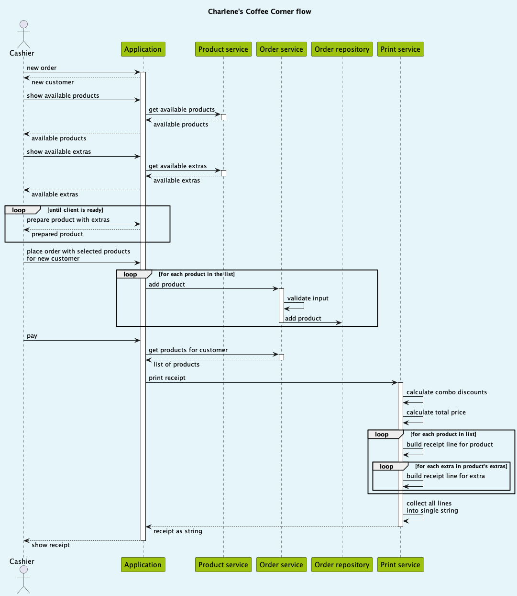

# Charlene's Coffee Corner

Application to print the receipts of customer orders.

## Implementation plan

_Application Elements:_
* _Main_ - main program with sample order flow
* _Application_ - controlling class, which provides functionality to inject dependencies into used classes and exposes order process related methods
* _ProductService_ - service to provide list of available offers and extras
* _OrderService_ - service, which collects the products into the order
* _OrderRepository_ - repository to store order for customer (in current implementation it is in-memory storage)
* _PrintService_ - service, which prints the receipt of customer order
* _Product_ - product, which customer can select into the order
* _Extra_ - extra ingredient, which can be attached to particular product


### Application sequence flow

`Application` class is a main controller of the application, which provides entry points for whoever will be using this application.
_Cashier_ is an external actor (in this implementation it is `Main` class with `main()` method), which can interact with the application.

Normal flow would be as follows:
- cashier starts new order
- cashier gets list of available products and extras
- collect products with possible extras and stamp card discount
- when customer is finished cashier places the order
- finally customer pays the order and cashier prints the receipt

Below is a sequence diagram, which represents the flow in the application. _Cashier_ is an external actor, all other 
participants are application internal services.



## Receipt layout
```text

      🅲🅷🅰🆁🅻🅴🅽🅴❜🆂 🅲🅾🅵🅵🅴🅴 🅲🅾🆁🅽🅴🆁                                                                  

----------------------------------------------------
 Product                      Price    Disc   Total

 Coffee (small)                2.50   -2.50    2.50
 Coffee (large)                3.50            3.50
  + Extra milk                 0.30   -0.30    0.00
 Coffee (medium)               3.00            3.00
  + Foamed milk                0.50            0.50
  + Special roast              0.90            0.90
 Bacon Roll                    4.50            4.50
 Freshly squeezed orange
 juice                         3.95            3.95

 TOTAL CHF                                    18.85
----------------------------------------------------
 07.04.2023 17:26:35
```

## Build application

This is a _Java_ application built with _Gradle_. 
Java 17 is required to build and run this application.
To build application execute following command:
```shell
./gradlew clean build
```

## Test application

This application can be tested with _Gradle_ as following:
```shell
./gradlew test
```

## Run application

This application can be run with _Gradle_ as following:
```shell
./gradlew run
```
